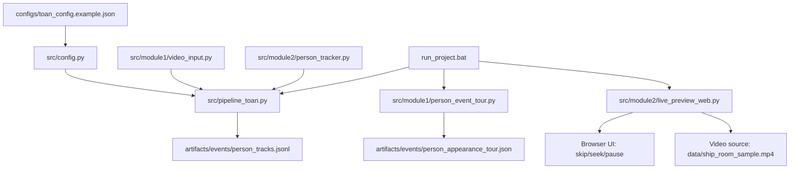

# So Do File Du An

## 1) Cay Thu Muc

```text
ship-room-monitoring/                           # Thu muc goc du an
|-- README.md                                   # Mo ta tong quan va huong dan su dung
|-- requirements.txt                            # Danh sach thu vien Python can cai
|-- run_project.bat                             # Script chay toan bo pipeline tren Windows
|-- yolov8s.pt                                  # Trong so YOLO dung de detect nguoi
|-- artifacts/                                  # Noi luu ket qua sinh ra sau khi chay
|   |-- events/                                 # File su kien dau ra
|   |   |-- person_appearance_tour.json         # Moc thoi gian cac doan co nguoi xuat hien
|   |   `-- person_tracks.jsonl                 # Log tracking tung frame (jsonl)
|   |-- preview_frames/                         # Trang/anh preview frame da annotate
|   |   `-- index.html                          # Trang web xem danh sach frame preview
|   `-- videos/                                 # Thu muc de luu video output (neu can)
|-- configs/                                    # Cac file cau hinh
|   `-- toan_config.example.json                # Cau hinh mau cho pipeline
|-- data/                                       # Du lieu dau vao
|   `-- ship_room_sample.mp4                    # Video mau de test
|-- docs/                                       # Tai lieu du an
|   |-- project_module_description.txt          # Mo ta chi tiet module va co che xu ly
|   `-- project_file_diagram.md                 # So do file va luong du lieu
`-- src/                                        # Ma nguon chinh
  |-- __init__.py                             # Danh dau package Python
  |-- config.py                               # Dinh nghia schema config Pydantic
  |-- pipeline_toan.py                        # Entry point chay pipeline batch
  |-- module1/                                # Nhom ingest va quet timeline
  |   |-- __init__.py                         # Danh dau package con module1
  |   |-- person_event_tour.py                # Quet nhanh cac doan co nguoi
  |   `-- video_input.py                      # Doc video/camera va lay mau frame
  `-- module2/                                # Nhom tracking va giao dien preview
    |-- __init__.py                         # Danh dau package con module2
    |-- live_preview_web.py                 # Flask web preview + seek/skip/pause
    `-- person_tracker.py                   # Detect + ByteTrack + check package zone
```

## 2) So Do Luong Theo Nhom File



## 3) Y Nghia Nhanh

- `src/module1`: ingest video va quet timeline xuat hien nguoi.
- `src/module2`: tracking, zone check, va live web preview.
- `src/pipeline_toan.py`: diem vao chinh cho batch pipeline.
- `artifacts/events`: output su kien de phan tich va ban giao module tiep theo.
